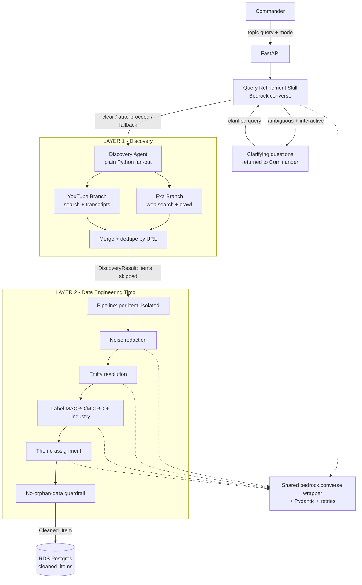
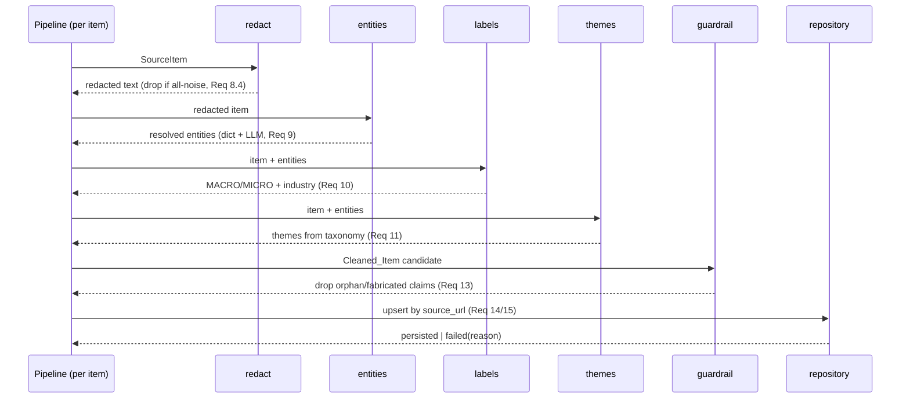
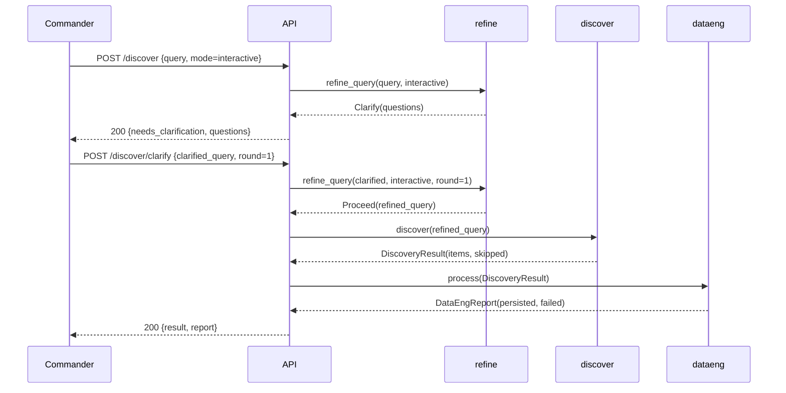

# Design Document

## Overview

This document designs **Layer 1 (Discovery)** and **Layer 2 (Data Engineering)** of the
Hedge Fund AI Agent Council — the two lowest layers that turn a single research-topic
query into clean, labelled, source-anchored rows in Postgres. It is the technical design
for the requirements in `requirements.md` and is scoped to those two layers only
(Analysts, Managers, Chairman, debate, backtest, and dashboard are out of scope).

Layer 1's fan-out is already implemented (`backend/app/discovery/`). This design
**formalizes** that code and **extends** it with one new LLM-backed step (query
refinement/clarification), then **drives the build** of Layer 2 (the "Timo" cleaner) and
the Postgres persistence layer.

### Guiding decisions (from the locked architecture)

- **Plain Python**, no agent framework, no LangGraph (Req 16).
- **AWS-only** backend: App Runner (compute) + RDS Postgres (storage) + Bedrock
  (reasoning), managed with **uv**, exposed via **FastAPI** (Req 16).
- Discovery fan-out/merge/dedupe = **plain Python, no LLM** (Req 16.5). Discovery's
  **only** LLM use is the Query Refinement skill (Req 2, Req 16.6).
- Data Engineering = a **reasoning layer**: Bedrock `converse` + Pydantic schemas (Req 12).
- **Plain Postgres**, no embeddings / vector DB (Req 15).
- **Default reasoning model: Claude Sonnet** on Bedrock, set as `bedrock_model_id` in
  config and used by query refinement and all Data Engineering skills (overridable
  per-skill).
- **Theme taxonomy: a configured list, not user-managed.** Themes are general market
  themes (e.g. Healthcare, Technology, Solar, Oil & Gas) defined in a backend
  `taxonomy.py`. The `themes.py` skill classifies each item against this taxonomy via the
  LLM; there is no watchlist in this layer.

## Scope

| In scope | Out of scope |
| -------- | ------------ |
| Query intake + validation (Req 1) | Analyst rubric scoring |
| Query refinement & clarification (Req 2) | Manager baskets / debate |
| Parallel Exa + YouTube fan-out (Req 3) | Chairman verdict / portfolio |
| Merge + dedupe (Req 4) | Backtest |
| Skip-with-reason failure handling (Req 5) | Frontend dashboard |
| Provenance + staleness metadata (Req 6) | Embeddings / vector DB |
| Data Eng: receive, redact, resolve, label, theme (Req 7-11) | |
| Bedrock reasoning + schema enforcement (Req 12) | |
| No-orphan-data guardrail (Req 13) | |
| Staleness metadata + Postgres persistence (Req 14-15) | |

## Architecture



### Module layout

```
backend/app/
├── config.py                 # Settings (+ bedrock + db config)
├── models.py                 # SourceItem, DiscoveryResult (existing) + new shapes
├── main.py                   # FastAPI routes
├── llm/
│   ├── bedrock.py            # shared converse() wrapper + schema enforcement + retries
│   └── schemas.py            # Pydantic I/O schemas for each skill
├── discovery/               # LAYER 1
│   ├── agent.py              # fan-out + merge + dedupe (existing)
│   ├── refine.py             # NEW: Query_Refinement_Skill
│   ├── exa_source.py         # web branch (existing)
│   └── youtube_source.py     # video branch (existing)
├── dataeng/                 # LAYER 2 (new)
│   ├── pipeline.py           # per-item orchestration (redact→resolve→label→theme→guard)
│   ├── redact.py             # noise redaction skill
│   ├── entities.py           # entity resolution (dict + LLM)
│   ├── labels.py             # MACRO/MICRO + industry
│   ├── themes.py             # market-theme taxonomy classification
│   └── guardrail.py          # no-orphan-data enforcement
├── db/
│   ├── session.py            # SQLAlchemy engine/session
│   ├── tables.py             # ORM table definitions (cleaned_items)
│   └── repository.py         # cleaned_items idempotent upsert by source_url
└── taxonomy.py               # Market_Theme_Taxonomy + built-in macro-alias map
```

> **Themes (configured taxonomy):** `taxonomy.py` holds the general market-theme list
> (e.g. `["Healthcare", "Technology", "Solar", "Oil & Gas", "Financials", ...]`).
> `themes.py` asks the LLM to classify each item against this fixed list (Req 11), and
> `entities.py` uses a built-in alias→ticker / macro-alias map. No watchlist, no DB-backed
> ticker list in this layer.

## Components and Interfaces

### 1. Shared Bedrock wrapper (`llm/bedrock.py`)

A single reusable helper used by the Query Refinement skill and every Data Engineering
skill. It satisfies the schema-enforcement and retry requirements (Req 12).

```python
T = TypeVar("T", bound=BaseModel)

def converse_structured(
    schema: type[T],
    system: str,
    user_content: str,
    *,
    model_id: str | None = None,
    max_retries: int = 3,          # Req 12.3 / 12.4: up to 3 retries (4 attempts)
) -> T:
    """Call Bedrock `converse`, parse the JSON reply, validate against `schema`.

    Retries on BOTH:
      - Pydantic ValidationError (model returned malformed/invalid JSON), and
      - transient Bedrock errors (ThrottlingException, timeouts).
    Raises BedrockReasoningError after retries are exhausted, tagged with the
    failure kind (schema_validation | transient) so callers can surface a reason
    (Req 12.5).
    """
```

Design notes:
- Uses `boto3` `bedrock-runtime.converse` (new dependency — added via `uv add boto3`).
- Default model is **Claude Sonnet** (`settings.bedrock_model_id`); per-skill override allowed.
- The reply is constrained to JSON by the system prompt; parsing failures are treated
  as schema-validation failures and retried.
- Exponential backoff between retries for transient errors.

### 2. Query Refinement skill (`discovery/refine.py`) — Req 2

The one LLM-backed step in Discovery, run **before** fan-out.

```python
def refine_query(query: str, mode: ClarificationMode, round: int = 0) -> RefinementOutcome:
    """Classify + rewrite a topic query, or request clarification.

    Returns one of:
      - Proceed(refined_query, original_query, proceeded_without_clarification: bool)
      - Clarify(original_query, questions: list[str], round: int)   # interactive only
    """
```

Behaviour (maps to Req 2 acceptance criteria):

| Situation | interactive mode | auto-proceed mode |
| --------- | ---------------- | ----------------- |
| Classified **clear** | rewrite → `Proceed` (2.2) | rewrite → `Proceed` (2.2) |
| Classified **ambiguous** | return `Clarify` questions, no fan-out (2.5) | best-effort rewrite → `Proceed`, flagged (2.6) |
| Clarified query resubmitted | re-run refine (2.7) | n/a |
| Max 2 rounds reached | proceed with latest query (2.8) | n/a |
| Bedrock call fails after retries | fall back to original query, record non-fatal reason (2.9) | same (2.9) |

The original query is always preserved alongside the refined query for audit (Req 2.3).

### 3. Discovery agent (`discovery/agent.py`) — Req 3-6 (existing, lightly extended)

Unchanged core: `ThreadPoolExecutor` fan-out to Exa + YouTube, `_safe_call` converts a
branch failure into a `SkippedSource` (Req 5), `_dedupe` keeps first-seen by exact `url`
(Req 4). The agent is invoked with the **refined** query produced by step 2.

`discover(query, max_results)` is extended to validate `max_results ∈ [1, 50]` (Req 3.6)
and to carry the original/refined query pair into the `DiscoveryResult` for audit.

### 4. Data Engineering pipeline (`dataeng/pipeline.py`) — Req 7-14

Processes each `SourceItem` **independently** so one failure never halts the batch
(Req 7.2/7.3). Per item, in order:



Skill notes:
- **redact** (Req 8): Bedrock removes ad reads/filler, preserves signal, keeps each
  surviving passage tied to its `TranscriptSegment.start` for video items. If the whole
  item is noise → exclude with reason (8.4).
- **entities** (Req 9): an alias→ticker map (built-in dict) plus a small built-in
  macro-alias map handles common cases cheaply; the LLM resolves the rest. De-duplicated
  canonical set; empty set allowed; never invents a mapping for unrecognized tokens
  (9.4/9.5).
- **labels** (Req 10): exactly one MACRO/MICRO + exactly one industry from the project
  sector list; `Unclassified` fallback (10.4).
- **themes** (Req 11): classify the item against the configured Market_Theme_Taxonomy
  (e.g. Healthcare, Technology, Solar, Oil & Gas) via the LLM; multiple themes
  de-duplicated; only taxonomy themes allowed; no match → no theme, item retained.
- **guardrail** (Req 13): drop any claim lacking `source_url`, any video claim lacking a
  valid `timestamp_start`, and any claim whose text is **not present in the source**
  (anti-hallucination) — each dropped with a surfaced reason.

### 5. Persistence (`db/repository.py`) — Req 14-15

- **RDS Postgres**, plain relational, **no embeddings/vector DB** (Req 15.2).
- **Idempotent upsert** keyed on `source_url` → exactly one row per URL (Req 15.5):
  `INSERT ... ON CONFLICT (source_url) DO UPDATE`.
- DB write failure → roll back (no partial row), mark item failed + reason, continue
  the batch (Req 15.6).
- SQLAlchemy Core/ORM for table defs; Alembic for the one initial migration.

## Data Models

### Existing (unchanged) — `models.py`

`SourceItem`, `TranscriptSegment`, `SkippedSource`, `DiscoveryResult` stay as built. The
only change to `DiscoveryResult` is two optional audit fields for the refined query.

### New Pydantic models

```python
from enum import Enum
from pydantic import BaseModel, Field

class ClarificationMode(str, Enum):
    INTERACTIVE = "interactive"     # default (Req 2.4)
    AUTO_PROCEED = "auto_proceed"

class QueryClassification(str, Enum):
    CLEAR = "clear"
    AMBIGUOUS = "ambiguous"

# --- Query Refinement I/O (Req 2) ---
class RefineLLMOutput(BaseModel):          # schema enforced on the Bedrock reply
    classification: QueryClassification
    refined_query: str
    clarifying_questions: list[str] = Field(default_factory=list)

class Proceed(BaseModel):
    original_query: str
    refined_query: str
    proceeded_without_clarification: bool = False
    refinement_failed: bool = False        # Req 2.9 fallback flag

class Clarify(BaseModel):
    original_query: str
    questions: list[str]
    round: int

# --- Labels / entities (Req 9-11) ---
class Stream(str, Enum):
    MACRO = "MACRO"
    MICRO = "MICRO"

class ResolvedEntity(BaseModel):
    canonical: str                          # "$META" or "Federal_Reserve"
    mentions: list[str] = Field(default_factory=list)

# --- The unit persisted to Postgres (Req 15) ---
class CleanedItem(BaseModel):
    source_url: str                         # non-empty, == origin (Req 13.1)
    source_type: SourceType
    title: str
    clean_text: str
    stream: Stream                          # MACRO | MICRO
    industry: str                           # sector or "Unclassified"
    entities: list[ResolvedEntity] = Field(default_factory=list)
    themes: list[str] = Field(default_factory=list)
    segments: list[TranscriptSegment] = Field(default_factory=list)  # video provenance
    published_at: str | None = None         # ISO8601, nullable (Req 14.1/14.2)
    ingested_at: datetime                   # UTC at persist time (Req 14.3/14.4)

class ProcessingFailure(BaseModel):
    source_url: str | None
    reason: str

class DataEngReport(BaseModel):             # Req 7.4/7.5 batch outcome
    persisted: int
    failed: int
    failures: list[ProcessingFailure] = Field(default_factory=list)
```

### Postgres schema (`db/tables.py`)

```sql
CREATE TABLE cleaned_items (
    id            BIGSERIAL PRIMARY KEY,
    source_url    TEXT NOT NULL UNIQUE,          -- upsert key (Req 15.5)
    source_type   TEXT NOT NULL,                 -- 'web' | 'youtube'
    title         TEXT NOT NULL,
    clean_text    TEXT NOT NULL,
    stream        TEXT NOT NULL,                 -- 'MACRO' | 'MICRO'
    industry      TEXT NOT NULL,                 -- sector or 'Unclassified'
    entities      JSONB NOT NULL DEFAULT '[]',   -- [{canonical, mentions[]}]
    themes        JSONB NOT NULL DEFAULT '[]',   -- ["Technology", "Solar", ...]
    segments      JSONB NOT NULL DEFAULT '[]',   -- [{start, text}] video provenance
    published_at  TIMESTAMPTZ NULL,              -- nullable (Req 14)
    ingested_at   TIMESTAMPTZ NOT NULL           -- UTC (Req 14)
);

CREATE INDEX idx_cleaned_items_stream   ON cleaned_items (stream);
CREATE INDEX idx_cleaned_items_industry ON cleaned_items (industry);
-- GIN indexes let later layers query by ticker/theme without a vector DB:
CREATE INDEX idx_cleaned_items_entities ON cleaned_items USING GIN (entities);
CREATE INDEX idx_cleaned_items_themes   ON cleaned_items USING GIN (themes);
```

> Note: The GIN indexes are how we get "queryable by ticker/theme" cheaply on plain
> Postgres — no embeddings (Req 15.2).

## API Design (`main.py`)

MVP-simple, synchronous. Three flows:

| Method & path | Purpose | Notes |
| ------------- | ------- | ----- |
| `GET /health` | liveness | existing |
| `POST /discover` | one-shot: refine (in given mode) → fan-out | body: `{query, mode?, max_results?}`. In `auto_proceed` or when clear, returns `DiscoveryResult`. In `interactive` + ambiguous, returns `Clarify` (HTTP 200, `needs_clarification: true`). |
| `POST /discover/clarify` | resume an interactive run with a clarified query | body: `{original_query, clarified_query, round}` → re-runs refine (Req 2.7), caps at 2 rounds (Req 2.8) |
| `POST /dataeng/process` | run Layer 2 over a `DiscoveryResult` | body: `DiscoveryResult` → returns `DataEngReport`; persists `CleanedItem`s |
| `GET /items` | read persisted cleaned items | query: `stream`, `theme`, `ticker`, `limit` → `list[CleanedItem]`, newest first |

The existing `GET /discover?query=` is kept for the CLI/back-compat; the new `POST`
variant carries `mode` and `max_results`.

### End-to-end sequence (interactive, ambiguous → clarified)



## Error Handling

| Failure (req) | Handling |
| ------------- | -------- |
| Empty / >500-char query (Req 1) | 422 validation error, no discovery |
| `max_results` out of [1,50] (Req 3.6) | 422 validation error, no fan-out |
| Branch key missing / branch error (Req 5.1/5.2) | record `SkippedSource(reason)`, continue |
| Video without captions (Req 5.3) | skip that video, continue |
| Both branches skipped (Req 5.6) | empty `items` + 2 `skipped`, no error raised |
| Refinement LLM fails (Req 2.9) | fall back to original query, non-fatal reason |
| Bedrock schema/transient failure (Req 12) | retry ≤3; then mark item failed + reason |
| All-noise item (Req 8.4) | exclude with reason |
| Orphan / fabricated claim (Req 13) | drop claim, surface reason, do not persist |
| DB write failure (Req 15.6) | rollback, mark item failed, continue batch |

## Testing Strategy

- **Unit (no network):**
  - `_dedupe` keeps first-seen by URL; merge preserves order (Req 4).
  - `_safe_call` converts `SourceUnavailable` / arbitrary exceptions into `SkippedSource`
    (Req 5) — already verifiable via the no-key smoke test.
  - Refinement outcome mapping per mode (clear/ambiguous × interactive/auto-proceed,
    round cap, fallback) with the Bedrock wrapper mocked (Req 2).
  - Guardrail drops orphan/fabricated claims (Req 13) on crafted inputs.
  - Entity dictionary resolution + de-dup; `Unclassified` label fallback.
- **Integration:**
  - Bedrock wrapper retry behaviour using a stubbed client (ValidationError then success;
    ThrottlingException then success; exhaustion → `BedrockReasoningError`).
  - Repository idempotent upsert: persist same `source_url` twice → one row (Req 15.5);
    simulated write failure → rollback + failure recorded (Req 15.6).
- **End-to-end (keys + a local Postgres):**
  - `POST /discover` (auto_proceed) → `POST /dataeng/process` → rows in `cleaned_items`,
    each with `source_url`, `stream`, `industry`, `ingested_at`.
- **Cleanup:** integration tests run against a disposable schema/table and tear it down.

## Correctness Properties

System-wide invariants that must hold regardless of input or execution path:

### Property 1: No orphan data

Every persisted `Cleaned_Item` has a non-empty `source_url`, and every video-derived
claim has a `timestamp_start >= 0`.

**Validates: Requirements 6.1, 13.1, 13.2**

### Property 2: No fabrication

No persisted claim contains text absent from its source item / transcript segment.

**Validates: Requirements 13.4**

### Property 3: One row per URL

After any number of `/dataeng/process` runs, `cleaned_items` contains at most one row per
`source_url`.

**Validates: Requirements 15.5**

### Property 4: Isolation

A failure on one source branch or one item never prevents other branches/items from
completing; failures are surfaced, never silently dropped.

**Validates: Requirements 5.1, 5.2, 7.2, 7.3, 15.6**

### Property 5: Audit-preserving refinement

Whenever the query is rewritten, the original query is retained alongside the refined one.

**Validates: Requirements 2.3**

### Property 6: Discovery purity

Discovery's fan-out, merge, and dedupe invoke no LLM; the only LLM call in Discovery is
query refinement.

**Validates: Requirements 16.5, 16.6**

### Property 7: Bounded reasoning

Every Bedrock call terminates within `max_retries`+1 attempts, and exhaustion yields a
surfaced failure rather than a hang or crash.

**Validates: Requirements 12.3, 12.4, 12.5**

### Property 8: Exactly-one labelling

Each persisted item carries exactly one MACRO/MICRO label and exactly one industry label.

**Validates: Requirements 10.1, 10.2, 10.3**

### Property 9: Themes drawn only from the taxonomy

Every theme assigned to a persisted item exists in the configured Market_Theme_Taxonomy;
no theme is invented outside it, and assigned themes are de-duplicated.

**Validates: Requirements 11.2, 11.4**

## New Dependencies

- `boto3` (Bedrock `converse`) — `uv add boto3`, then re-export `requirements.txt`.
- `sqlalchemy` + `psycopg[binary]` (Postgres) and `alembic` (one migration).

## Resolved Decisions

1. **Default Bedrock model:** Claude Sonnet, configured as `settings.bedrock_model_id`
   and used by query refinement and all Data Engineering skills.
2. **`POST /dataeng/process` is a separate call** — it is not auto-triggered at the end of
   `/discover`. The caller runs discovery first, then submits the `DiscoveryResult` to
   Data Engineering.
3. **Themes = a configured taxonomy, not a watchlist.** General market themes (Healthcare,
   Technology, Solar, Oil & Gas, ...) are defined in `taxonomy.py`; the theme skill
   classifies each item against that fixed list via the LLM. No watchlist in this layer.
