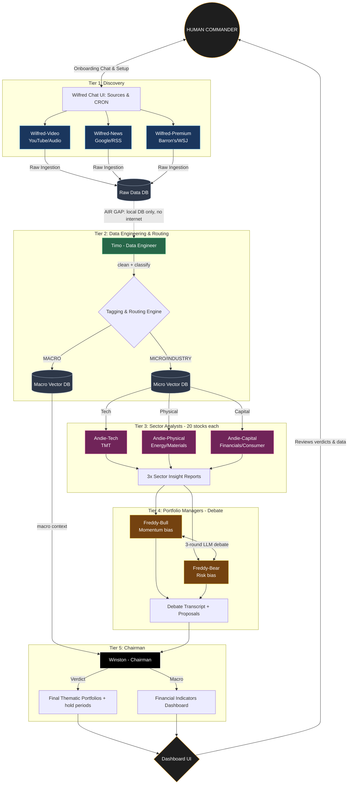

# Hedge Fund AI Agent Council

> **Project guidance** distilled from the planning conversations. This is the single
> source of truth for what we're building, why, and how the pieces fit together.
> Hand the relevant sections to engineers building the orchestrator and workers.

---

## 0. Architecture Evolution (v1 → v2)

The system evolved from a **4-agent linear council** into a **5-tier Multi-Agent
System (MAS)**. The pattern is, formally:

- **MapReduce / Fan-Out → Fan-In** — many specialist workers analyze in parallel, a
  supervisor aggregates. (How a real hedge-fund analyst floor is structured: sector
  desk analysts → portfolio manager → CIO.)
- **Mixture of Experts (MoE)** — agents are domain-specialized, not generalists.
- **Adversarial Reasoning (LLM Debate)** — a Bull and a Bear debate before a Chairman
  judges, to defeat LLM **sycophancy** (the tendency to agree with whatever it's fed).

The original four roles (Wilfred, Timo, Andie, Freddy) remain, but Wilfred/Andie/Freddy
scale out into **squads**, and a new top tier — **Winston, the Chairman** — is added.

---

## 1. Problem Statement

The user has very little time but wants to make informed US-equity investment
decisions from a large volume of financial news videos (YouTube), podcasts, and
articles. We need a system that **"reads" and "analyzes" transcripts on their
behalf** and surfaces only the financial/economic/investment signal they care about.

Two research approaches must be supported:

- **Top-Down** — scan headlines / macro sources for anything new.
- **Bottom-Up** — run through a Stock Watchlist and find news per individual stock.

**Scope (v1):** US public equities only.

**End outcome:**

1. A dashboard monitoring financial-health indicators.
2. Portfolio **themes** of recommendations (e.g. AI data-centre buildout, banking,
   space, advanced materials) + the individual stocks under each theme.
3. **Backtest** validation: "if you invested $10,000 in this theme, how much would
   you have made over 3 / 6 / 12 months?"

---

## 2. The 5-Tier Agent Architecture

The user is the **"Commander."** Agents do the work in the background as a strict
pipeline (a DAG — see §6).

| Tier  | Squad / Agent  | Role                                    | Fan |
| ----- | -------------- | --------------------------------------- | --- |
| **1** | **Wilfred** ×3 | Discovery / ingestion (per channel)     | OUT |
| **2** | **Timo**       | Data engineer **& semantic router**     | 1   |
| **3** | **Andie** ×3   | Sector analysts (20 stocks each)        | OUT |
| **4** | **Freddy** ×2  | Portfolio managers — **debate chamber** | —   |
| **5** | **Winston**    | **Chairman** — final judge & allocator  | IN  |

### Workflow diagram (Mermaid)



### The Macro Bypass

Timo routes `[MICRO]`/`[INDUSTRY]` data to the Andies, but routes `[MACRO]` data
**around** the analysts directly to Winston. This keeps the Andies laser-focused on
their 20 companies (no macro hallucination), while giving the Chairman the
overarching view needed to sanity-check the portfolios against the macro regime.

---

## 3. Agent Specifications (by tier)

### Tier 1 — Wilfred Squad (Discovery)

Split into 3 agents, one per channel. **Why split:** fault isolation (a Barron's
paywall change can't crash YouTube/Google ingestion), tool specialization, and ~3×
concurrency.

| Agent               | Channel        | Tools                                          |
| ------------------- | -------------- | ---------------------------------------------- |
| **Wilfred-Video**   | YouTube/audio  | `yt-dlp`, Whisper, SponsorBlock                |
| **Wilfred-News**    | Google / RSS   | Google SERP / Programmable Search, RSS parsers |
| **Wilfred-Premium** | Barron's / WSJ | Playwright, anti-bot evasion, proxy rotation   |

- **Onboarding Chat (UI):** Wilfred greets the Commander on login — _"I'm tracking 40
  channels. Any new YouTube channels, keywords, or Barron's columns to add today?"_
- **Cron Manager (UI):** a table to view Wilfred's heartbeat and edit sync schedules
  (e.g. "Barron's daily at 6 AM", "YouTube every 4 hours").

### Tier 2 — Timo (Data Engineer & Semantic Router)

The traffic controller. Cleans transcripts (ads, filler, ticker normalization), then
runs a fast/cheap LLM (e.g. Llama-3-8B) as a **classifier + router**:

- **Tagging** — every paragraph → `[MACRO]` (Fed, CPI, geopolitics), `[MICRO]`
  (earnings, CEO quotes, product launches), or `[INDUSTRY]` (supply chain, "semi
  cycle", "copper deficit").
- **Watchlist routing** — groups the 60-stock watchlist by theme/sector; an Apple
  supply-chain mention is tagged `[MICRO]` + `[TECH]` and routed **to Andie-Tech**.
- **Time-decay embedding** — stamps every chunk for TTL (see §5).

### Tier 3 — Andie Squad (Sector Analysts)

3 agents, **20 companies each** (60 total). Capping at 20 avoids **context
degradation** ("lost in the middle") and keeps the LLM's attention sharp.

> 🚨 **Critical rule — group by SECTOR/MACRO THEME, never alphabetically.** A random
> split destroys contextual alpha; sector grouping makes each agent a domain expert.

| Agent              | Desk                         | Becomes sensitive to…                         |
| ------------------ | ---------------------------- | --------------------------------------------- |
| **Andie-Tech**     | TMT (semis, software, comms) | capex spend, supply-chain constraints         |
| **Andie-Physical** | Energy / Industrials / Mats  | commodity prices, regulation, power-grid load |
| **Andie-Capital**  | Financials / Consumer / RE   | interest rates, consumer credit, inflation    |

- **Input:** only the concentrated `[MICRO]`/`[INDUSTRY]` data for their 20 names.
- **Output:** a daily **"Investment Highlights & Catalyst Note"** per desk → pushed to
  the managers' inbox. (3 reports; 60 stocks covered.)

### Tier 4 — Freddy Squad (Debate Chamber)

Freddy splits into two adversarial personas to stress-test every thesis:

- **Freddy-Bull** (growth/momentum) — argues why the reports justify going Long.
- **Freddy-Bear** (value/risk) — attacks the thesis: flaws, macro headwinds, failure.

**Debate protocol (3 rounds):** both read all 60 Andie reports →
R1 Bull proposes a thematic portfolio (e.g. _Memory Chips: Micron, SK Hynix; ~6-month
hold_) → R2 Bear attacks (_"Micron overvalued; Andie-Tech notes capex slowing"_) →
R3 Bull defends/adjusts. The **full transcript is logged** and sent up to the Chairman.

### Tier 5 — Winston (Chairman)

The ultimate judge & macro allocator.

- **Verdict & final portfolio:** reads the Freddy debate transcripts; cold, objective,
  capital-preserving. Issues a verdict (_"Bull's memory-chip thesis holds, but Bear's
  valuation concern is valid → initiate a half-position in Micron"_) and constructs the
  final stock baskets with hold periods.
- **Macro dashboard:** consumes the `[MACRO]` data routed straight to him (the Macro
  Bypass) to populate the Financial Indicator Dashboard (inflation, Fed rates,
  sentiment), ensuring micro portfolios fit the macro environment.

---

## 4. Clean-Room Backtest Protocol

To validate strategies on **Jun–Dec 2025** data without **look-ahead bias** (using
future data to "predict" the past):

1. **Prep:** scrape the full Jun–Dec 2025 dataset into the local stores first.
2. **Air-gap Tiers 2–5:** Timo, all Andies, both Freddys, and Winston have web / SERP /
   external-API tools **disabled** — local Vector DB access only.
3. **Inject the simulation date** into every system prompt:
   _"You are in a strict simulation. The current date is `[Injected_Date]`. Rely ONLY
   on the provided vector database. Do not use pre-trained knowledge of events after
   this date."_
4. **Logic flow only** is allowed from the internet for Tier-1 discovery during real
   (non-backtest) operation; backtest runs stay fully air-gapped.

---

## 5. Data Staleness & Time-Decay (TTL)

A 3-month-old "inflation is peaking" take can produce confidently wrong advice today.

- **Metadata stamping:** every chunk carries `publish_date` + `ingest_date`.
- **Signal half-life:** `[MACRO]` data has a long shelf life (~3–6 months);
  `[MICRO]` data is stale fast (~1 month).
- **Windowed retrieval:** agents query with a dynamic time filter, e.g.
  `WHERE ticker='MU' AND date > (CURRENT_SIMULATION_DATE - 30 days)`.
- **UI staleness label:** backtested theses are tagged with age, e.g.
  _"Thesis formulated 45 days ago — high risk of staleness."_

---

## 6. Orchestration — the Pipeline is a DAG

The tiers form a strict **Directed Acyclic Graph**: Winston can't run until the Freddys
finish debating; the Freddys can't run until all 3 Andies finish; the Andies can't run
until Timo tags & routes; Timo can't run until Wilfred ingests.

- Use a durable task queue / workflow engine — **Temporal, Celery+Redis, or Inngest**.
- **Triggering:** Wilfred & Timo on **cron**; Andie on **event** (new clean transcript);
  Freddy/Winston on **stage completion** + a weekly **cron** for the thesis drop.

---

## 7. Core Features

### 7.1 Semantic Keyword & Concept Tracker

- Track the **meaning** of a phrase (e.g. "AI bubble collapse" also matches "tech
  valuations are unsustainable"), not literal string matching.
- Channel-level only (isolated single-transcript datapoints are meaningless).
- Graph: **mentions over time**, per-channel breakdown, **Context Preview** (exact
  quote + jump-to-timestamp).
- **Max 15 trackers.** At 16, warn; deleting archives historical vector data.
- Start mode: **forward-only** OR **run historically**.

### 7.2 Signal / Indicator Generator (Rubric Engine)

User defines indicators + rubrics; Andie grades every transcript.
Examples: Macro Outlook, Inflation Trajectory, Interest Rate Policy, Market Sentiment,
Sector Trends, Geopolitical Risk.

- Output per indicator: Positive/Neutral/Negative OR High/Med/Low OR %Score.
- **Must include evidence** (quotes/facts + source timestamp).

### 7.3 Insight Generator

- **Predictions** — resolvable True/False after a time window → **Prediction Ledger**
  leaderboard ranking channel/analyst accuracy (Brier-score style).
- **Top 10 Quotes** of the week.
- **Weekly Investment Thesis** — synthesized market outlook.
- **Thematic + Stock-Specific Ideas** with Strategy / Risk / Timeline, plus AI
  follow-up questions critiquing assumptions and 2nd/3rd-order effects.
- **Debate transcripts** — the logged Bull-vs-Bear argument behind each verdict.

---

## 8. Composite Signal — ACE Index

**AI Capital Environment Index.** High ACE = favorable macro + dovish policy + bullish
AI capex.

```python
class CompositeSignalGenerator:
    def calculate_ace_index(self, ai_sentiment, rate_expectations, inflation_drag):
        """
        Weights dynamically adjustable by Winston based on macro regime.
        Default: AI Sentiment 40%, Rates 30%, Inflation 30%.
        Returns float in [-1.0 (capital starved) .. +1.0 (capital abundant)].
        """
        return (ai_sentiment * 0.4) + (rate_expectations * 0.3) + (inflation_drag * 0.3)
```

- `rate_expectations`: +1 = dovish (cuts), -1 = hawkish.
- `inflation_drag`: +1 = disinflation tailwind, -1 = high inflation drag.
- Plot ACE Index overlaid on AI indices (`$SMH`, `$QQQ`, `$ARKK`) to validate alpha.

---

## 9. User Flows

### Flow 1 — Cold Start (configuration)

1. **Onboarding Chat:** converse with Wilfred to add sources (YouTube / RSS / Barron's)
   and keywords; set CRON schedules in the Cron Manager.
2. **Watchlist (Bottom-Up):** import US tickers → Timo groups by sector and assigns each
   to the right Andie desk.

### Flow 2 — Create a Signal/Tracker

- Fork: **Concept/Keyword Tracker** (phrase + target channels + historical/forward
  toggle) **or** **Custom Indicator Rubric** (name + rubric definition).

### Flow 3 — Daily Consumption Loop (< 5 min)

1. **Command Center:** Winston's daily briefing + watchlist alerts.
2. Tracker graphs → hover a spike → **Context Preview** → "Go to Source" opens the
   video at the exact `HH:MM:SS`.

### Flow 4 — Thesis, Debate & Backtest

1. **Investment Thesis page:** generated portfolio themes (strategy, stocks, risk,
   timeline) + a **"View Debate Transcript"** dropdown to read the Bull/Bear argument.
2. **Backtest:** Clean-Room run over Jun–Dec 2025 → equity curve vs S&P 500, ROI, max
   drawdown, with a staleness label on the thesis.

---

## 10. UI / Page Map

1. **Command Center (Dashboard)** — daily briefing, top macro shifts, thematic
   portfolios, watchlist alerts.
2. **Signal & Tracker Terminal** — keyword/semantic graphs + indicator heatmap.
3. **Investment Thesis & Backtest** — themes, **View Debate Transcript**, backtest,
   What-If scenarios ("what if inflation prints 3.5% tomorrow?").
4. **Sources & Agents** — Onboarding Chat, **Cron Manager** table, agent heartbeat;
   Prediction Ledger leaderboard.
5. **Financial Indicator Dashboard** — macro indicators (Winston-driven), watchlist,
   key events.

---

## 11. Tech Stack

| Layer            | Choice                                                               |
| ---------------- | -------------------------------------------------------------------- |
| Orchestration    | Temporal / LangGraph / AutoGen (strict DAG, durable workflows)       |
| Reasoning LLM    | Claude Sonnet / GPT-4o (Andie, Freddy, Winston)                      |
| Debate models    | **Two different model families** for Bull vs Bear (less collusion)   |
| Cheap router LLM | Llama-3 8B (Timo's high-volume classify + clean)                     |
| Relational DB    | Supabase / PostgreSQL (users, keywords, predictions, schedules)      |
| Vector DB        | Pinecone — separate **Macro** and **Micro** namespaces, TTL metadata |
| Frontend         | Next.js + TypeScript + Tailwind (this repo's `frontend/`)            |
| Jobs/Compute     | Temporal / Celery + Redis / Inngest (async long-video processing)    |
| Market data      | Polygon.io / YFinance                                                |

> This repo: `backend/` (Python) + `frontend/` (Next.js + TypeScript).

---

## 12. Engineering Constraints & Guardrails

1. **Air-gap for backtests** — Tiers 2–5 have no internet; inject the simulation date;
   local Vector DB only. Prevents look-ahead bias.
2. **20-stock cap per Andie** — keeps LLM attention sharp; group by sector, never
   alphabetically.
3. **Macro bypass** — `[MACRO]` data goes straight to Winston, not the Andies.
4. **TTL / time-decay** — every datapoint stamped; windowed queries; staleness labels.
5. **15-tracker limit** — 16th create warns; delete archives the tracker's vector data.
6. **No orphan data** — every Quote/Score MUST carry `source_url` + `timestamp_start`;
   the user must always be able to audit the AI's logic.
7. **Channel-level tracking only** — never track isolated single transcripts.
8. **Strict DAG** — downstream tiers wait for upstream completion (no partial runs).

---

## 13. Reference — Sectors of Interest

Technology · Consumer Discretionary · Healthcare · Industrials · Financials ·
Communication Services · Consumer Staples · Energy · Real Estate · Utilities ·
Basic Materials.
